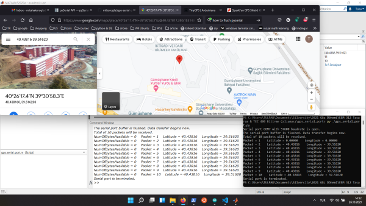
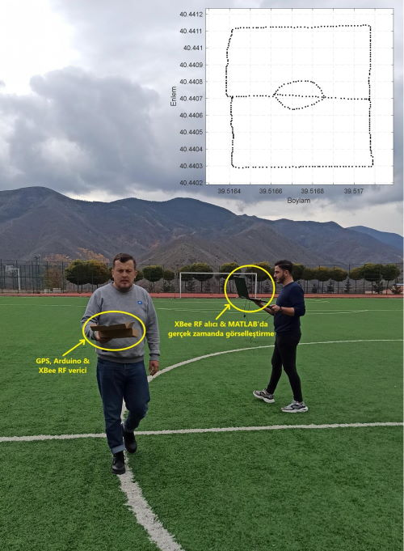

# GPS Verisinin Bilgisayara Kablosuz Transferi ve Gerçek-Zamanlı Görüntülenmesi
Bu projede 

https://www.sparkfun.com/products/retired/13199

GPS alıcısını kullanıyoruz. Shield ile geldiğinden direk üstten Arduino Uno'ya bağlanıyor. **TinyGPS** kütüphanesi [1]

https://github.com/mikalhart/TinyGPS

kullanarak Arduino'ya transfer edilen enlem ve boylam verisini bilgisayara hem MATLAB hem de Python ile okuduk. Python'da bu işi yapabilmek için **numpy** ve **pyserial** [2] paketlerine ihtiyaç duyduk. 

GPS kodunu MATLAB ve Python'a transfer edip ekrana basan kodların açıklamasını izlemek için aşağıdaki resme tıklayınız.

Gümüşhane Üniversitesi Stadyumu'nda yapılan bir yürüyüşün verisinin gerçek zamanda MATLAB'da görselleştirilmesini izlemek için aşağıdaki resme tıklayın.

## Kaynaklar
[1] TinyGPS 13 by Mikal Hart - http://arduiniana.org/2013/09/greater-accuracy-with-tinygps-13/ 
[2] **pyserial** kütüphanesi - https://pyserial.readthedocs.io/en/latest/
