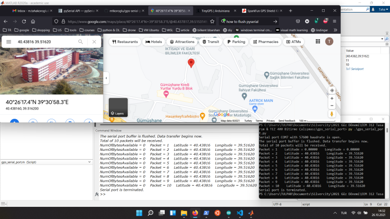

# GPS Verisinin Bilgisayara Kablosuz Transferi ve Gerçek-Zamanlı Görüntülenmesi
Bu projede 

https://www.sparkfun.com/products/retired/13199

GPS alıcısını kullanıyoruz. Shield ile geldiğinden direk olarak Arduino Uno'ya bağlanıyor. TinyGPS kütüphanesi kullanarak Arduino'ya transfer edilen enlem ve boylam verisini bilgisayara hemen MATLAB ve Python ile okuduk. Yapılanları izlemek için aşağıdaki resme tıklayınız.

